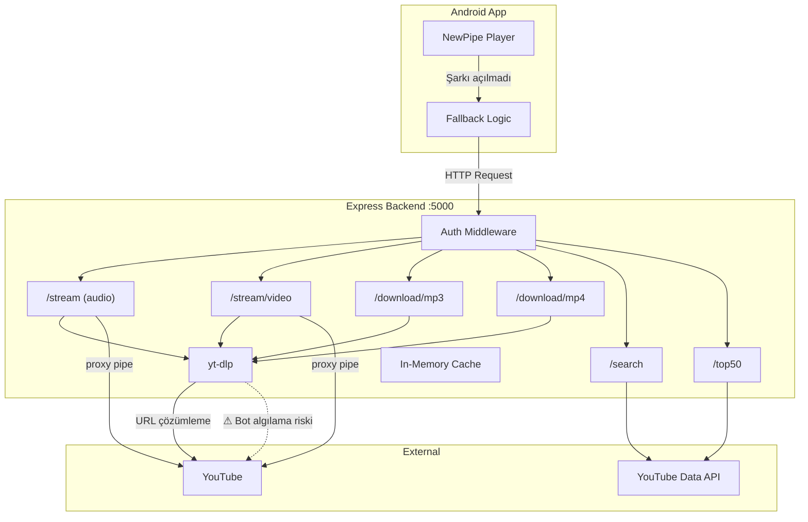

# 🎵 Ringtone Backend — Proje Analizi & İlerleme Planı

## 📁 Mevcut Proje Yapısı

| Dosya | Açıklama |
|---|---|
| [server.js](file:///c:/Users/BoB-Opr-07/Downloads/ringtone-backend-deploy/server.js) | Ana backend — tüm API endpointleri burada |
| [package.json](file:///c:/Users/BoB-Opr-07/Downloads/ringtone-backend-deploy/package.json) | Bağımlılıklar: express, yt-dlp-exec, axios, ioredis, p-queue |
| [config.json](file:///c:/Users/BoB-Opr-07/Downloads/ringtone-backend-deploy/config.json) | Global ayarlar (enabled, mode) |
| [Dockerfile](file:///c:/Users/BoB-Opr-07/Downloads/ringtone-backend-deploy/Dockerfile) | Docker imajı (node:20 + python + ffmpeg) |
| [cookies.txt](file:///c:/Users/BoB-Opr-07/Downloads/ringtone-backend-deploy/cookies.txt) | YouTube cookie dosyası (yt-dlp için) |
| [blockedChannels.json](file:///c:/Users/BoB-Opr-07/Downloads/ringtone-backend-deploy/blockedChannels.json) | Engelli kanal listesi (şu an boş) |

## 🔌 API Endpointleri

| Endpoint | Metod | Açıklama | Auth |
|---|---|---|---|
| `/health` | GET | Sağlık kontrolü | ❌ |
| `/config` | GET/POST | Config okuma/yazma | ✅ |
| `/top50` | GET | YouTube Trend Top 50 (Music) | ✅ |
| `/search` | GET | YouTube arama | ✅ |
| `/stream` | GET | yt-dlp ile audio streaming (m4a) | ❌ |
| `/stream/video` | GET | yt-dlp ile video streaming (mp4) | ❌ |
| `/download/mp3` | GET | Audio indirme (m4a) | ❌ |
| `/download/mp4` | GET | Video indirme (mp4) | ❌ |

---

## 🚨 Tespit Edilen Kritik Sorunlar

### 1. YouTube Bot Algılama (En Önemli Sorun)

> [!CAUTION]
> yt-dlp kullanımı YouTube tarafından bot olarak algılanabilir. Mevcut koddaki önlemler yetersiz.

**Mevcut durum:**
- [cookies.txt](file:///c:/Users/BoB-Opr-07/Downloads/ringtone-backend-deploy/cookies.txt) dosyası var ama **yt-dlp çağrılarında kullanılmıyor**
- `extractorArgs: "youtube:player_client=android"` sadece download endpointlerinde var, `/stream` ve `/stream/video`'da **yok**
- `User-Agent` header'ı basit `"Mozilla/5.0"` — tam değil, kolayca tespit edilir
- Sunucudan aynı IP ile çok sayıda istek = YouTube rate limit / ban

### 2. Güvenlik Zafiyetleri

> [!WARNING]
> API key ve secret hardcoded olarak kodda duruyor.

- `x-app-key: "RINGTONE_MASTER_V2_SECRET_2026"` düz metin olarak kodda
- `/stream`, `/stream/video`, `/download/*` endpointleri **auth gerektirmiyor** — herkes kullanabilir
- `YOUTUBE_API_KEY` sadece env'den alınıyor ama kontrol yok (undefined olabilir)

### 3. Docker'da yt-dlp Eksik

> [!IMPORTANT]
> Dockerfile'da python ve ffmpeg kuruluyor ama **yt-dlp kurulmuyor**. `yt-dlp-exec` npm paketi yt-dlp binary'sini otomatik indirebilir ama bu güvenilir değil.

### 4. Redis Kullanılmıyor

- `ioredis` ve `redis` paketleri dependency'de var ama **hiçbir yerde import/kullanım yok**
- Tüm cache in-memory `Map()` ile yapılıyor — sunucu restart'ında kaybolur

### 5. Cache & Queue Eksiklikleri

- `/stream` endpointi cache kullan**mıyor** (her seferinde yt-dlp çağırıyor)
- `/stream/video` cache kullanıyor ama `/stream` (audio) kullanmıyor — tutarsız
- Queue sadece `/download/*` endpointlerinde var, `/stream` endpointlerinde **yok**

---

## 📋 Fazlar

### Faz 1: Kritik Düzeltmeler (Bot Algılama & Güvenlik)

> [!IMPORTANT]
> Bu faz en yüksek öncelikli — bot engeli uygulamayı tamamen çalışamaz hale getirir.

| # | Görev | Durum |
|---|---|---|
| 1.1 | yt-dlp çağrılarına `--cookies cookies.txt` ekle | ⬜ |
| 1.2 | Tüm yt-dlp çağrılarına `extractorArgs: "youtube:player_client=android"` ekle | ⬜ |
| 1.3 | Gerçekçi User-Agent rotasyonu ekle (birden fazla UA) | ⬜ |
| 1.4 | İstekler arası rastgele gecikme (jitter) ekle | ⬜ |
| 1.5 | Proxy desteği ekle (residential proxy rotasyonu) | ⬜ |
| 1.6 | Hardcoded secret'ları `.env` dosyasına taşı | ⬜ |
| 1.7 | Stream/download endpointlerine auth ekle | ⬜ |
| 1.8 | Dockerfile'a `pip install yt-dlp` ekle | ⬜ |

---

### Faz 2: Mimari İyileştirmeler (Cache & Performans)

| # | Görev | Durum |
|---|---|---|
| 2.1 | Redis entegrasyonu — tüm cache'leri Redis'e taşı | ⬜ |
| 2.2 | `/stream` audio endpointine cache ekle | ⬜ |
| 2.3 | `/stream` endpointlerine queue (p-queue) ekle | ⬜ |
| 2.4 | Stream URL'lerini önceden çözümleme (pre-resolve) — top50'deki videolar için | ⬜ |
| 2.5 | Search cache süresini config'den yönet | ⬜ |
| 2.6 | [blockedChannels.json](file:///c:/Users/BoB-Opr-07/Downloads/ringtone-backend-deploy/blockedChannels.json) filtrelemesini implement et | ⬜ |

---

### Faz 3: Dayanıklılık (Fallback & Hata Yönetimi)

| # | Görev | Durum |
|---|---|---|
| 3.1 | yt-dlp başarısız olursa alternatif player_client dene (ios, web) | ⬜ |
| 3.2 | YouTube API quota biterse Invidious/Piped API fallback | ⬜ |
| 3.3 | Circuit breaker pattern — yt-dlp sürekli hata verirse geçici durdur | ⬜ |
| 3.4 | Detaylı hata loglama (video ID, hata tipi, timestamp) | ⬜ |
| 3.5 | `/health` endpointini genişlet — yt-dlp, Redis, YouTube API durumlarını göster | ⬜ |

---

### Faz 4: Ölçekleme & Dağıtım

| # | Görev | Durum |
|---|---|---|
| 4.1 | PM2 veya cluster mode ile multi-process çalıştırma | ⬜ |
| 4.2 | Docker Compose — Redis + Backend birlikte | ⬜ |
| 4.3 | Birden fazla sunucuya dağıtım (load balancer) | ⬜ |
| 4.4 | CDN üzerinden static content cache | ⬜ |
| 4.5 | Country-based config ile bölgesel yt-dlp strateji | ⬜ |

---

### Faz 5: İzleme & Analitik

| # | Görev | Durum |
|---|---|---|
| 5.1 | Request loglama (hangi video, hangi ülke, ne zaman) | ⬜ |
| 5.2 | yt-dlp başarı/başarısızlık oranı dashboard | ⬜ |
| 5.3 | YouTube API quota kullanım takibi | ⬜ |
| 5.4 | Uptime monitoring (UptimeRobot / Healthchecks.io) | ⬜ |
| 5.5 | Rate limit ihlali alertleri | ⬜ |

---

## 🏗 Mimari Diyagram (Mevcut)

---

## 📊 Öncelik Matrisi

| Faz | Etki | Zorluk | Öncelik |
|---|---|---|---|
| Faz 1 — Bot Algılama & Güvenlik | 🔴 Kritik | 🟡 Orta | **🥇 En Yüksek** |
| Faz 2 — Cache & Performans | 🟠 Yüksek | 🟡 Orta | **🥈 Yüksek** |
| Faz 3 — Fallback & Hata Yönetimi | 🟠 Yüksek | 🟠 Yüksek | **🥉 Orta-Yüksek** |
| Faz 4 — Ölçekleme | 🟡 Orta | 🔴 Yüksek | Orta |
| Faz 5 — İzleme | 🟢 Düşük-Orta | 🟢 Düşük | Düşük |
